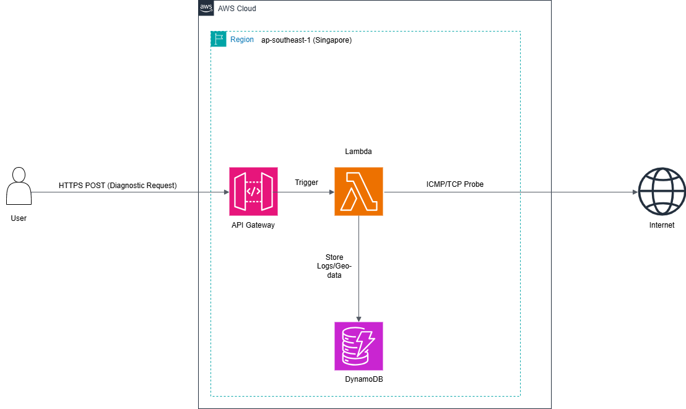

Cloud Lab: Enterprise-Grade AWS Infrastructure PoC
This repository serves as a centralized showcase for cloud-native solutions, focusing on serverless orchestration, automated biometric analysis, and distributed network diagnostics. All infrastructures follow the AWS Well-Architected Framework with a focus on security and cost-efficiency.

Technical Environment
Primary Region: ap-southeast-1 (Singapore)

Architecture Pattern: Pure Serverless (Zero-idle cost)

Compliance: Regional Data Residency and Principle of Least Privilege (PoLP)

Module 1: NET_PROBE
Distributed Network Diagnostic and Geo-Auditing Engine

A serverless utility designed for real-time network latency analysis and geographic auditing of target endpoints.

Architecture Diagram:

Architecture Highlights
Ingestion Layer: RESTful interface managed by AWS API Gateway to receive diagnostic metadata.

Compute and Egress: AWS Lambda executes non-blocking ICMP/TCP probes, traversing the regional network boundary to reach external global targets.

Persistence: Amazon DynamoDB stores historical logs with an active TTL (Time To Live) policy for automated data lifecycle management.

Module 2: FACE_BIOMETRIC
AI-Enhanced Biometric Intelligence Pipeline

An experimental biometric verification system integrating Computer Vision and Large Language Models (LLMs) for automated identity risk assessment.

Architecture Diagram:

Architecture Highlights
Entry Point: AWS API Gateway ingests base64-encoded image payloads directly to the processing layer.

Orchestration: AWS Lambda performs runtime format normalization and coordinates concurrent calls to downstream AI services.

Computer Vision: Amazon Rekognition executes facial vector extraction and similarity matching.

Intelligence Layer: Amazon Bedrock (Claude 3 Flash) synthesizes raw biometric metadata into human-readable security reports.

Repository Structure
/assets: High-fidelity AWS infrastructure diagrams.

/src: Production-ready Lambda source code (Python 3.x).

/docs: Detailed technical specifications and decision logs.

index.html: Web-based interface for live module demonstration.

STATUS: SYSTEM_READY // REGION: AP-SOUTHEAST-1 // 2026 Tuan Anh
