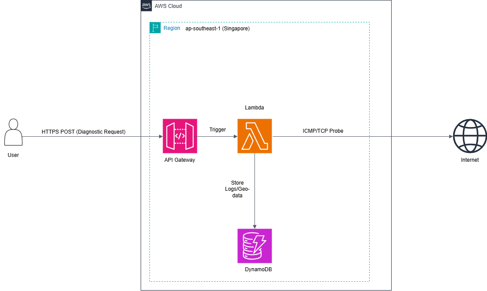
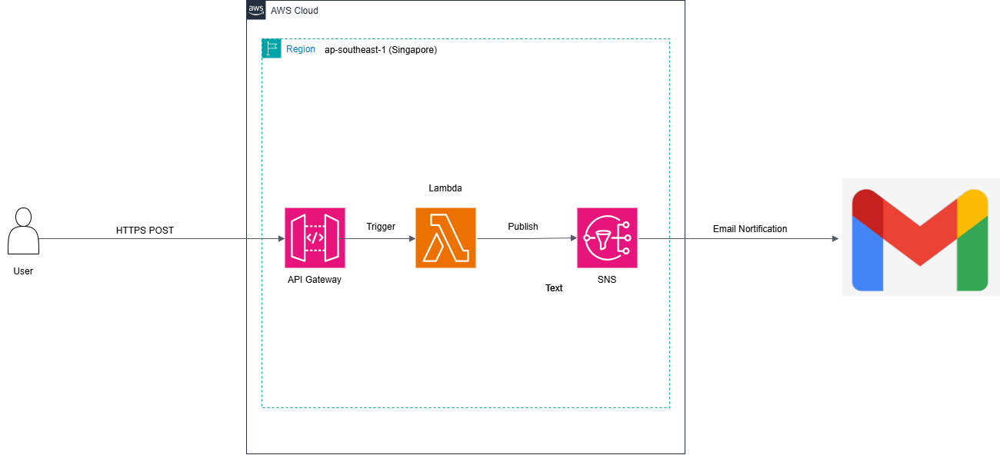

# CLOUD LAB: ENTERPRISE-GRADE AWS INFRASTRUCTURE POC

**Live Demonstration:** [https://net-probe.vercel.app/](https://net-probe.vercel.app/)

> This repository serves as a centralized showcase for cloud-native solutions, focusing on **Serverless Orchestration**, **Automated Biometric Analysis**, and **Distributed Network Diagnostics**. All infrastructures follow the **AWS Well-Architected Framework** with a strict focus on Security (PoLP) and Cost-Optimization (FinOps).

---

## TECHNICAL ENVIRONMENT

* **Primary Region:** `ap-southeast-1` (Singapore)
* **Architecture Pattern:** Pure Serverless (Zero-idle cost) & Event-Driven
* **Compliance:** Regional Data Residency & Principle of Least Privilege (PoLP)
* **CI/CD:** GitHub Actions (Automated Deployment Pipeline)

---

## MODULE 1: NET_PROBE
### Distributed Network Diagnostic and Geo-Auditing Engine

A serverless utility designed for **real-time network latency analysis** and geographic auditing of target endpoints.

### Architecture Highlights
* **Ingestion Layer:** RESTful interface managed by **AWS API Gateway**.
* **Compute & Egress:** **AWS Lambda** executes non-blocking ICMP/TCP probes, traversing the regional network boundary.
* **Persistence:** **Amazon DynamoDB** stores historical logs with an active **TTL (Time To Live)** policy for automated data lifecycle management.


---

## MODULE 2: FACE_BIOMETRIC
### AI-Enhanced Biometric Intelligence Pipeline

An experimental biometric verification system integrating **Computer Vision** and **Large Language Models (LLMs)** for automated identity risk assessment.

### Architecture Highlights
* **Entry Point:** **AWS API Gateway** ingests base64-encoded image payloads.
* **Orchestration:** **AWS Lambda** coordinates concurrent calls to downstream AI services.
* **Computer Vision:** **Amazon Rekognition** executes facial vector extraction and similarity matching.
* **Intelligence Layer:** **Amazon Bedrock (Claude 3 Haiku)** synthesizes raw biometric metadata into human-readable security reports.



---

## MODULE 3: SOS_BEACON
### Tactical Emergency Uplink & Geo-Spatial Messaging System

A critical response mechanism designed to bridge the gap between client-side telemetry and cloud-native notification pipelines.

### Architecture Highlights
* **Telemetry Acquisition:** Leverages **HTML5 Geolocation API** for high-precision coordinate capture.
* **Event Ingestion:** **AWS API Gateway** provides a secure, low-latency webhook.
* **Logic & Formatting:** **AWS Lambda** processes the payload and generates tactical map visualizations (Google Maps deep-linking).
* **Broadcast Layer:** **Amazon SNS** executes a "Fan-out" pattern to instantly broadcast alerts to administrators via Email/SMS.



---

## HYBRID LAB & ENTERPRISE SCALABILITY (DEVOPS ROADMAP)

**Architectural Decision Record (ADR):** While the live production environment utilizes a **Serverless Zip-based** architecture (DynamoDB, Lambda, API Gateway) for maximum cost-efficiency and event-driven agility, this repository includes a complete **IaC and Containerization Lab** to demonstrate enterprise-grade staging, orchestration, and observability capabilities.

Explore the **[infrastructure](./infrastructure)** directory to view the engineered artifacts:

* **Infrastructure as Code (IaC):** Terraform blueprints to automatically provision an immutable AWS EC2 environment (Security Groups, AL2023). Built with FinOps principles—environments are ephemeral and tore down post-validation via `terraform destroy`.
* **Containerization:** Docker & Docker-Compose strategies bridging serverless logic into containerized workloads via a custom Python Adapter, standardizing local and hybrid execution.
* **Observability:** Prometheus & Grafana stack configured to scrape container metrics, ensuring system reliability, fault detection, and real-time performance monitoring.
* **Target Architecture (EKS):** Kubernetes `Deployment.yaml` manifests featuring High-Availability replicas (3x) and strict Resource Quotas (OOM Protection) to prepare for horizontal scaling.

---

## REPOSITORY STRUCTURE

* `assets/`: High-fidelity AWS Serverless infrastructure diagrams.
* `backend/`: Production-ready Lambda source code (Python 3.x) & Docker API Adapters.
* `infrastructure/`: IaC Blueprints (Terraform, Docker Compose, K8s Manifests, Monitoring Configs).
* `.github/workflows/`: CI/CD Pipelines for automated serverless deployment.
* `index.html`: Web-based interface for live module demonstration.

---
```bash
STATUS: SYSTEM_READY // REGION: AP-SOUTHEAST-1 // ENGINEER: NGUYEN TRAN TUAN ANH
